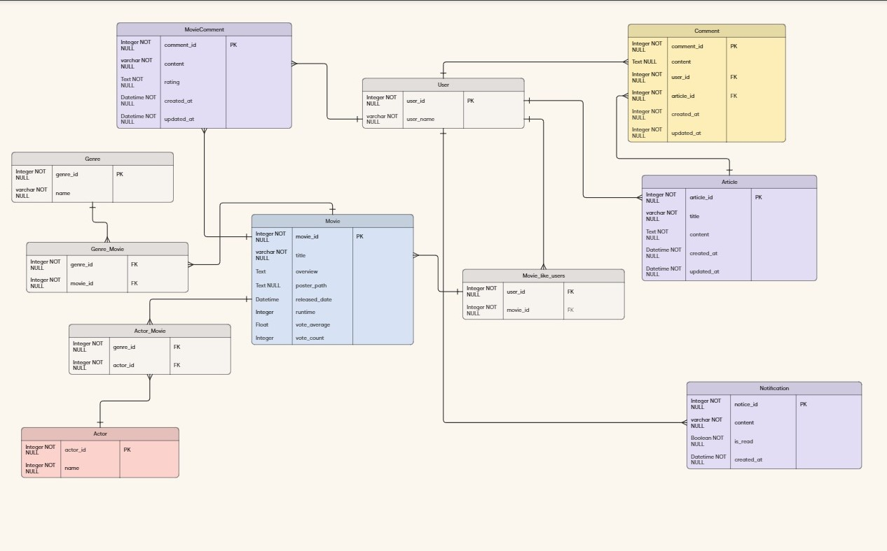
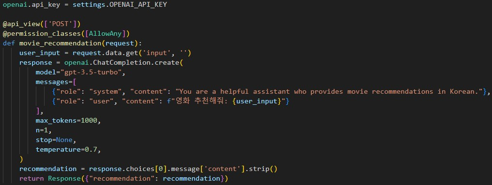
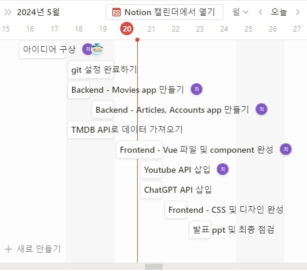
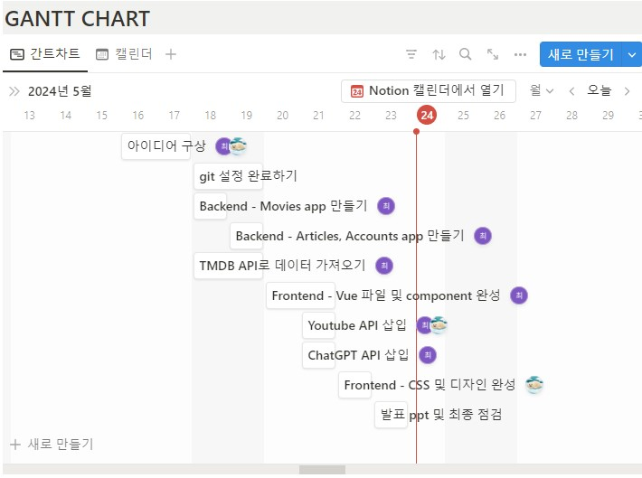
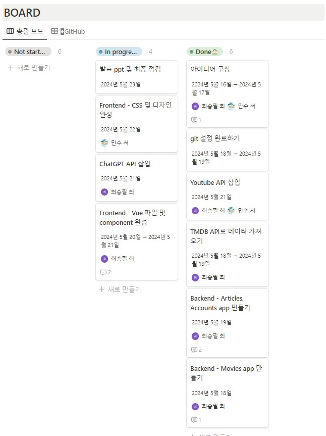

# 팀원 정보 및 업무 분담 내역
  ### 팀장 : 최승필

  ### 팀원 : 서민수

# 목표 서비스 구현 및 실제 구현 정도
 1. 영화 조회 서비스
    
  - 홈 화면에 영화 추천 
    - 현재 상영중
    - 인기순
    - 평점 높은 순
    - 개봉 예정작

  - 영화 상세 조회
    - Youtube trailer 영상 제공
    - 개봉일, 런타임, 줄거리, 출연 배우 제공
    - 사용자 평점, 사용자 리뷰 , 찜 기능 제공
  - 카테고리 별 조회 
    - 영화 장르별로 조회 (액션, 애니메이션, 스릴러 등)
    - 검색결과 정렬 (인기순, 평점 순, 가나다 순, 최신 순)
  - 영화 검색 기능(제목으로)
  - Ai 추천 기능
    - Chatgpt가 유저에게 보고 싶은 영화 추천
  - Community 기능
    - 영화 같이 볼 파트너 찾기 게시판 운영
    - 댓글 기능 및 다른 유저와 채팅 기능
  - 프로필 기능
    - 프로필 사진 설정 기능 
    - 다른 유저와 팔로우/언팔로우(구현 x)
    - 프로필 페이지에서 유저가 쓴 평점,  리뷰 , 찜 확인 가능 (구현 x)
2-2. 구현 실패
 - 알림 기능
 - 다른 유저와의 채팅 기능
 - 다른 유저와의 팔로우, 언팔로우
 - 다른 유저의 프로필 페이지 확인
3. ERD

4. 영화 추천 알고리즘에 대한 기술적 설명
  - 최대한 다양한 사람들의 취향을 맞출 수 있도록, 주어진 데이터를 활용해 알고리즘의 다양화 및 세분화를 위해 노력
  - 기본적으로 주어지는 값들인 출시 년도, 인기도, 평점, 반응 수 등을 척도 삼아 순서대로 나열해 사람들이 많이 찾을 가능성이 다분한 기준을 세워 영화를 나열
  - 인공지능 활용해 대량의 데이터를 학습한 인공지능 모델로 사람들의 니즈를 맞출 수 있는 추천 알고리즘 구현
  - 장르별로 영화 구분해서, 장르별로도 이전에 구현했던 최신순, 인기도, 평점 순, 평가 많은 순으로 정렬해 사람들에게 만족도 높은 서비스 제공
  
5. 핵심 기능에 대한 설명
  - 인공지능을 활용한 영화 추천
    - 평소 우리와 친숙한 ChatGPT API를 활용하여, 영화 추천해주는 역할을 부여함으로써 상황, 장르 등에 맞는 영화를 추천해주는 알고리즘 구현
    
  - 영화 친구 구하기 게시판
    - 썸 타는 사이, 그리고 연인 간 가장 많이 하는 데이트 코스 중 하나인 영화보는 것을 공략해, 혼자 보러 가는 것보다는 영화 취향이 맞는 사람들을 서로 구해서 친목도 다지고 서로 단순 영화 메이트를 넘어서 새롭고 소중한 인간관계를 형성할 수 있도록 하는 게시판 기능

6. 기타(느낀점, 후기 등)
  - 팀장 최승필: 굉장히 힘들고 정신없는 일주일이었던 것 같다. 주어진 시간은 굉장히 짧았고, 지난 시간 동안 나름 열심히 복습하고 공부했다고 생각했는데도 원하는 대로 되지 않아서 정말 고생을 많이 했다. 그만두고 싶다는 생각이 들면서도, 시간과 노력을 투자한 프로젝트를 기획했던 대로 최대한 구현하기 위해 매일매일을 밤낮 없이 몰두했던 것 같다. 생각했던 기능이 생각한 대로 이뤄지지 않았을 때의 좌절감도 있었지만, 셀 수 없는 수많은 시도 끝에 그것을 이뤄냈을 때의 느낌이 정말 짜릿했던 것 같다. 웹 개발의 세계는 정말 크고, 끊임없이 발전하고 있다는 것을 몸소 체험할 수 있는 기회였고, 내 자신의 부족함을 다시 한번 느낄 수 있는 기회였던 것 같다. 시간이 조금 더 있었으면 하는 아쉬움이 있었으면서도, 이러한 생활이 더 길어졌다면 내 자신이 정말 피폐해졌을 수도 있었겠다는 생각도 들었다. 앞으로 남은 싸피 기간동안 공부와 프로젝트 모두에 열심히 몰두하여, 발전하는 자세를 지닌 개발자로 거듭나도록 해야겠다.

  - 팀원 서민수: 실력이 많이 부족한 상태에서 시작하기도 하고 프로젝트를 처음 해보는 거여서 파트너에게 혹시나 걸림돌이 되지는 않을까막막했다 파트너인 승필이와 기획을 하고 아이디어를 구상하다보니 어느 정도 기초 틀을 완성 시켰다.
  한 4개월 동안 실습한 것을 바탕으로 교안을 뒤져보며 코드를 짜보았지만 기초가 좀 부족해서 힘들었다. 기획 할때에는 시간에 맞춰서 완성 할 줄 알았지만 하다 보니 잘 안되는 것도 많고 디버깅을 하다보니 시간이 생각보다 촉박하였다. 그러다 보니 기획했을때 생각한 아이디어들을 다 구현 하지는 못하였다. 아쉬움이 있지만 프로젝트를 진행하면서 많이 성장한 것 같다 다음에는 이 경험을 발판 삼아 더 잘 해보고 싶다. 마지막으로 일주일을 함께한 최승필 학우에게 감사 말씀을 올리고 싶다. 

7. 배포 서버 URL(배포할 경우)

# 기획
### 일정

- 5월 16일, 17일
  - 아이디어 구상하기
- 5월 18일
  - backend - movies app 만들기
  - TMDB API로 데이터 가져오기
- 5월 19일
  - backend - articles, accounts app 만들기
  - TMDB API로 데이터 가져오기
- 5월 20일
  - frontend views, components 기본 구조 구축 완료하기
- 5월 21일
  - 구축된 views, components 채워넣기
  - youtube api로 트레일러 영상 구현
- 5월 22일
  - chatgpt api 삽입 및 구현
  - frontend - css 및 디자인 완성
- 5월 23일
  - 코드 최종 점검 및 발표 ppt 제작

### 노션을 활용한 일정 및 할일 관리

  - 최초에 기획할 때, 간트차트를 활용해 향후 일정 관리

  - 날이 지남에 따라 진도를 수시로 체크해 프로젝트의 완성 정도 표시 및 기록

  - 표 형식으로 진도를 기록하여 현재까지의 해놓은 일들과 앞으로 할 일 파악
  
### 프로젝트 진행 과정
2024.5.16 ~ 5.17 
- 목표 서비스 설정
- 페이지 초안, 필요한 기능 등에 관하여 회의 및 DB 모델링 
- Figma 툴 이용 전체 페이지 디자인 Mock-up 완성

2024.5.17 ~ 5.18
- DRF 기초 구조 기획
- ERD 완성

2024.5.19
- Vue 기초 components, views 파일 구조 정리 완료
- DRF 회원가입, 댓글달기, 로그인, 로그아웃 기능 완성 
- TMDB API 활용해 영화 데이터 DB에 삽입 완료(약 10000개)
  
2024.5.20
- Vue 상에서의 회원가입, 회원정보 수정, 마이페이지(프로필), 로그아웃 구현 완료

2024.5.21
- modal 이용해 youtube 트레일러 띄움(미완성)
- nav bar 일부 수정하여 보완
- 영화 detail page 구현
- 홈페이지 배경화면 사진 제작

2024.5.22
- 장르별 추천 페이지 완성
- navbar 일부 기능 보완 완료
- 미개봉 영화도 표시되던 신작 영화 상영중인 영화만 나오도록 구현
- 영화 상세 페이지에 들어갈 내용 전부 삽입
- 프로필 페이지 정보 구현 완료
- 수정 필요했던 backend 보완
- 검색기능 frontend 구현 완료
- navbar, 홈페이지 css 구현 완료

2024.5.23
- navbar 구현 완성
- 새로고침 필요했던 로그인, 회원정보 수정 구현 완료
- 게시판, 글 작성 및 댓글 작성 구현 완료
- css 구현 완료
- ChatGPT API 삽입 완료
- 홈페이지에서 랜덤하게 영상 뜨도록 제작 완료

### 화면 표시
- 현재 상영, 인기순, 평점 높은 순, 개봉 예정작
  => 모두 한 페이지에 표현!(vue에서 component 여러 개 사용해서)

