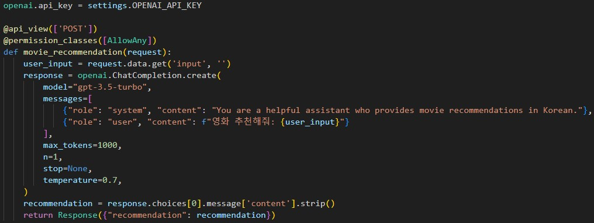

# 1. Movie-Mate

### 기간 : 24.05.16 ~ 24.05.23 (1주)
### 인원 : 2명 ( FE : 1, BE : 1 )

https://github.com/seomsoo/Movie-Mate/assets/156265567/1bb18fa6-95c5-4c03-b8d0-8e4a6b9d9a9a

# 2. 개발 환경

 

## Front-End
  
 
       

## Back-End
  

 

# 3. 주요 기능
 1. 영화 조회 서비스
    
  - 홈 화면에 영화 추천 
    - 현재 상영중
    - 인기순
    - 평점 높은 순
    - 개봉 예정작

  - 영화 상세 조회
    - Youtube trailer 영상 제공
    - 개봉일, 런타임, 줄거리, 출연 배우 제공
    - 사용자 평점, 사용자 리뷰 , 찜 기능 제공

  - 카테고리 별 조회 
    - 영화 장르별로 조회 (액션, 애니메이션, 스릴러 등)
    - 검색결과 정렬 (인기순, 평점 순, 가나다 순, 최신 순)
  - 영화 검색 기능(제목으로)

  - Ai 추천 기능
    - Chatgpt가 유저에게 보고 싶은 영화 추천
    

  - Community 기능
    - 영화 같이 볼 파트너 찾기 게시판 운영
    - 댓글 기능 및 다른 유저와 채팅 기능

  - 프로필 기능
    - 프로필 사진 설정 기능 
    - 다른 유저와 팔로우/언팔로우(구현 x)
    - 프로필 페이지에서 유저가 쓴 평점,  리뷰 , 찜 확인 가능 

# 4. 팀원 역할 및 담당
| Contributors | Role | Position |
| ------------ | ---- | -------- |
| 　최승필 | 팀장,   Backend | - 백엔드 전반 |
| 　서민수 | 팀원,   FrontEnd | - 프론트엔드 전반, UX/UI  |
